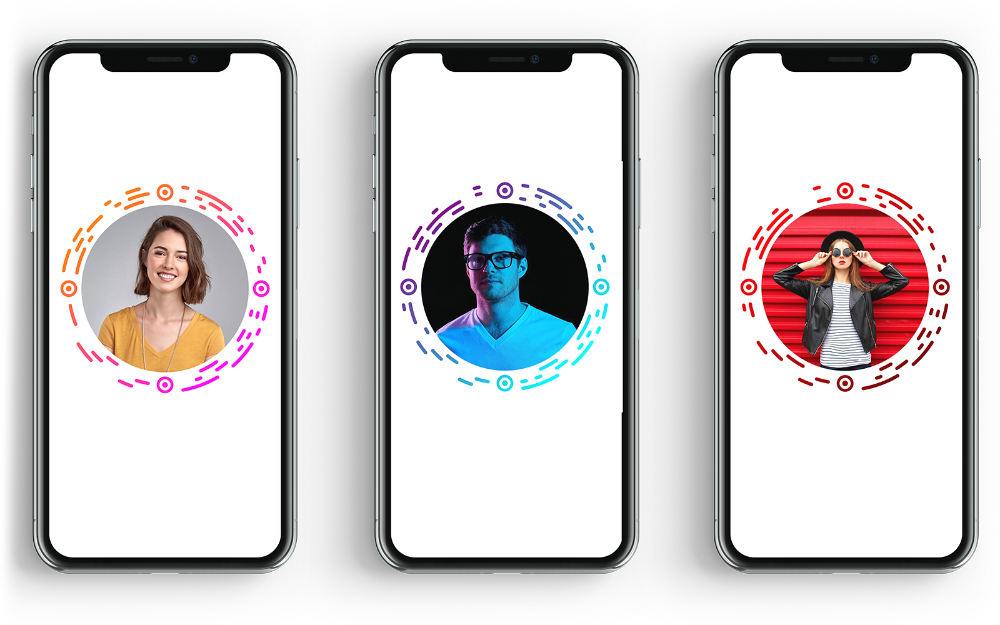
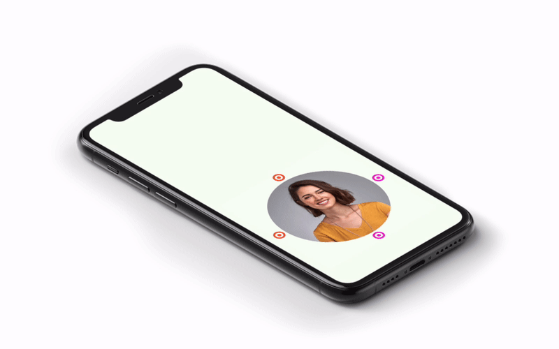

# RoundCode for iOS

[](https://github.com/aslanyanhaik/RoundCode/blob/master/LICENSE)
[](https://swift.org)
[](https://twitter.com/aslanyanhaik)


RoundCode is a Facebook messenger like custom QR code with lots of customization. 

In addition to encoder the RoundCode also includes convenient camera scanner and decoder.

<h3 align="center">

</h3>

## Installation

### Cocoapods:

```curl
pod 'RoundCode'
```

### Swift Package Manager:

File > Swift Packages > Add Package Dependency

```swift
https://github.com/aslanyanhaik/RoundCode
```

## Usage example

import framework

```swift
import RoundCode
```

### Encoding
create coder and encode

```swift
let image = RCImage(message: "Hello World")
let coder = RCCoder()
do {
  imageView.image = try coder.encode(image)
} catch {
  //handle errors
}
```

You can also validate the messsage before encoding

```swift
let coder = RCCoder()
let isValidText = coder.validate("Hello world")
```

### Decoding

Create instane of RCCameraViewController and handle the delegate

```swift
class ViewController: UIViewController, RCCameraViewControllerDelegate {
  
  func scan() {
    let cameraController = RCCameraViewController()
    cameraController.delegate = self
    present(cameraController, animated: true)
  }
  
  func cameraViewController(didFinishScanning message: String) {
    messageLabel.text = message
  }
}
``` 

You can also decode a UIImage like this

```swift
let coder = RCCoder()
do {
  messageLabel.text = try coder.decode(UIImage(named: code)!)
} catch {
  //handle errors
}
```

## Appearance

You can change the appearance like this

```swift
var image = RCImage(message: "Hello world")
image.contentInsets = UIEdgeInsets(top: 8, left: 10, bottom: 4, right: 10)
image.attachmentImage = UIImage(named: "Profile")
image.size = 300
image.gradientType = .linear(angle: CGFloat.pi)
image.tintColors = [.red, .black]
```
If image is on dark background you should change scanning mode to `darkBackground`

```swift
let coder = RCCoder()
coder.scanningMode = .darkBackground
```

## Advanced coding configuration

You can provide custom coding configuration in order to encode long text by reducing number of characters

```swift
let configuration = RCCoderConfiguration.shortConfiguration
let coder = RCCoder(configuration: configuration)
```

```swift
let configuration = RCCoderConfiguration(characters: " -abcdefghijklmnopqrstuvwxyz0123456789")
let coder = RCCoder(configuration: configuration)
```

⚠️ If you are encoding with custom configuration, then you should change the RCCameraViewController configuration ⚠️

```swift
let configuration = RCCoderConfiguration(characters: " -abcdefghijklmnopqrstuvwxyz0123456789")
let coder = RCCoder(configuration: configuration)
let camera = RCCameraViewController()
camera.coder = coder
```

## Compatibility

Written in Swift 5 and requires Xcode 11.0

RoundCode is compatible with iOS 13.0+.

<h3 align="center">

</h3>

## Author

* [Haik Aslanyan](https://twitter.com/aslanyanhaik)

## License

Copyright 2020 Haik Aslanyan.

Licensed under MIT License: https://opensource.org/licenses/MIT
